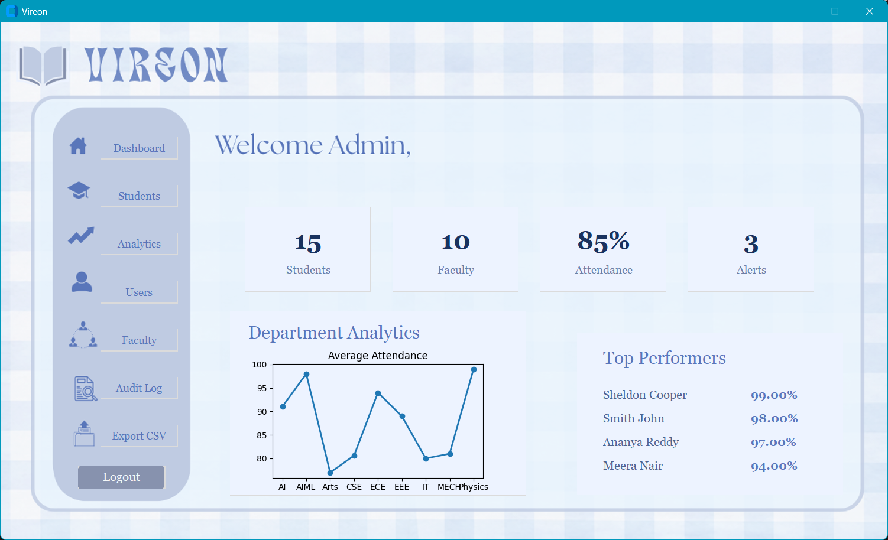
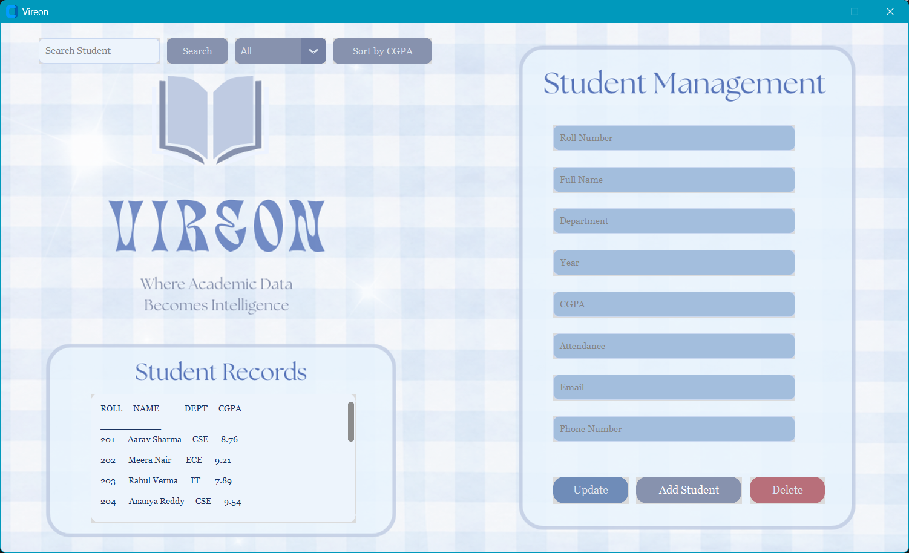
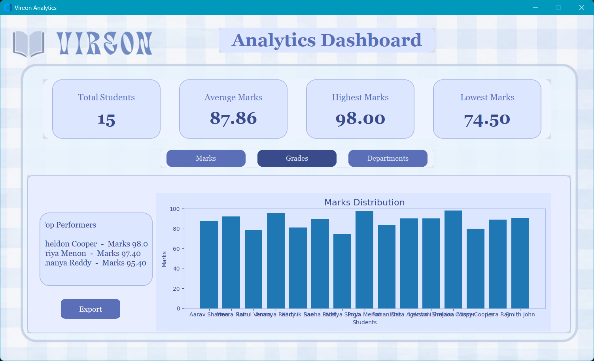
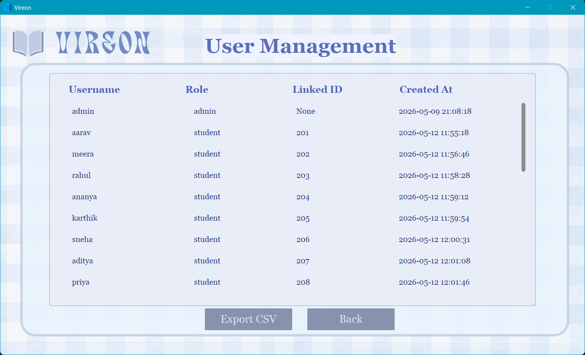
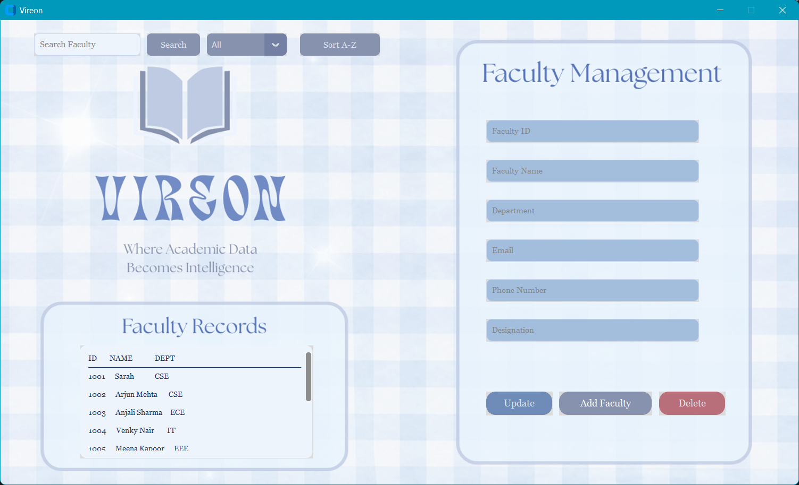
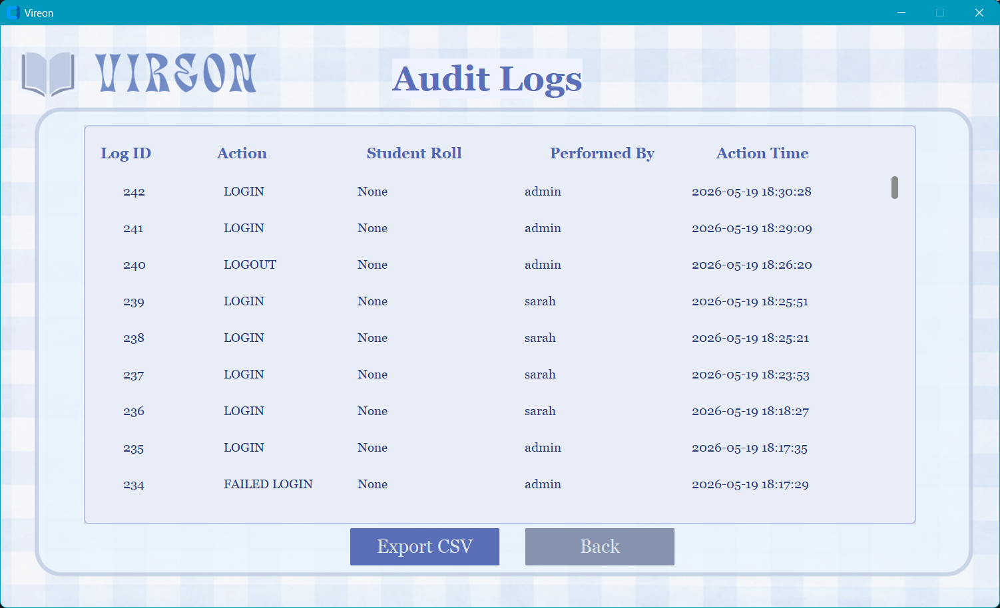
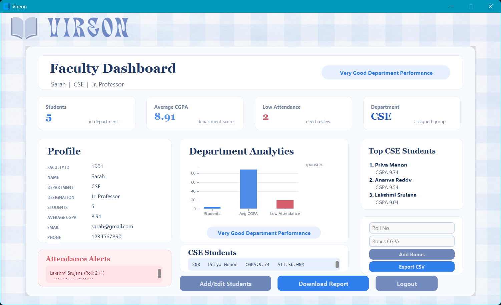
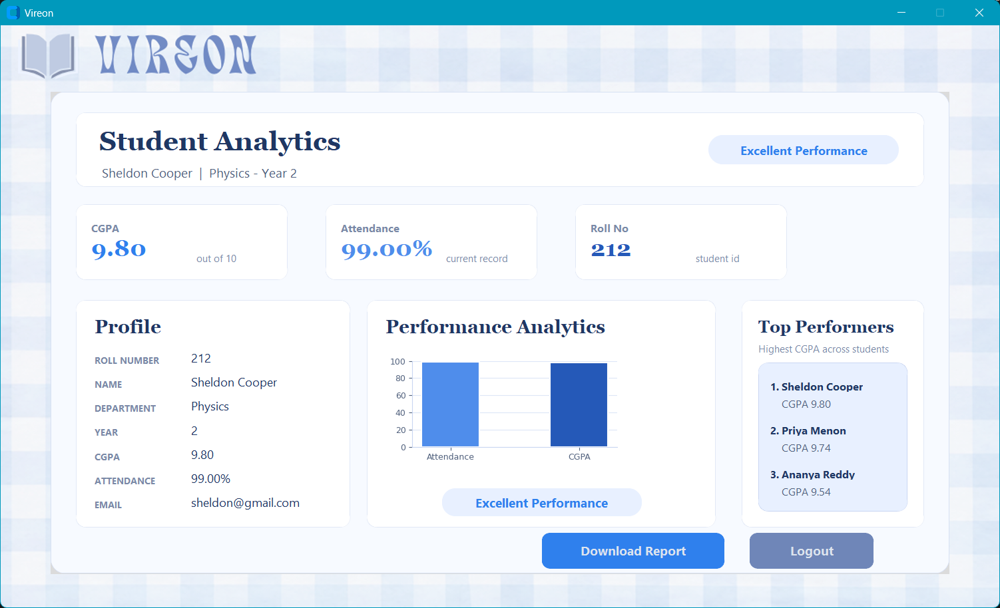

# 🦅 Vireon — Student Performance Analyzer

> A role-based desktop application for managing student academics, attendance, and performance analytics — built with Python, CustomTkinter, and MySQL.

---

## 📸 Overview

Vireon is a full-featured **Student Performance Analyzer** desktop application developed as a Database Management Systems Lab mini project. It supports three distinct user roles (Admin, Faculty, Student), enforces secure authentication, logs every data-changing operation, and presents a live analytics dashboard — all packaged as a Windows installer.











---

## ✨ Features

### 🔐 Authentication & Security
- SHA-256 hashed password login
- Case-insensitive username matching via MySQL collation
- Role-based access control (Admin / Faculty / Student)
- Every login attempt (success or failure) recorded in audit log

### 👤 Role-Based Dashboards

| Feature | Admin | Faculty | Student |
|---|:---:|:---:|:---:|
| Dashboard analytics | ✅ | ✅ | |
| Add / Edit student | ✅ | ✅ | |
| Delete student | ✅ | | |
| Search by department | ✅ | ✅ | |
| View all students | ✅ | ✅ | |
| View own record | | | ✅ |
| Marks & GPA analytics | ✅ | ✅ | |
| Top performers / leaderboard | ✅ | ✅ | ✅ |
| Add bonus marks | ✅ | ✅ | |
| Export high performers to CSV | ✅ | ✅ | |
| Manage user accounts | ✅ | | |
| View audit log | ✅ | | |
| Create MySQL app users | ✅ | | |

### 📊 Analytics & Reporting
- Live dashboard: total students, average/highest/lowest marks
- Grade distribution (A / B / C / D / F) using SQL `CASE` expressions
- Department-wise average, highest, and lowest marks
- Top 3 performers leaderboard
- Department ranking by average marks
- Attendance histogram and CGPA distribution graphs
- Export high performers to timestamped CSV

### 🗄️ Advanced DBMS Features
- **Triggers** — Audit log trigger, low attendance alert trigger
- **Stored Procedures** — Add student, GPA calculation, department report
- **Views** — Top students view, low attendance view, department summary view
- **Indexes** — Roll number, department, and email indexes for query optimization
- **CTEs** — Ranked students, department comparison queries
- **Temporary Tables** — Dynamic ranking and attendance ranking tables

---

## 🗃️ Database Schema

```
spa_db
├── users          (id, username, password_hash, role, is_active, created_at)
├── students       (id, name, department, marks, user_id, enrolled_at)
├── faculty        (id, name, department, user_id)
├── attendance     (id, student_id, subject, date, status)
├── marks          (id, student_id, internal, external, gpa)
├── departments    (id, name)
├── alerts         (id, student_id, type, message, created_at)
└── audit_log      (id, user_id, action, details, timestamp)
```

**Design principles applied:** ER Diagram · 1NF / 2NF / 3NF normalization · Primary & Foreign Keys · Referential Integrity · Query Optimization

---

## 🛠️ Tech Stack

| Layer | Technology |
|---|---|
| Language | Python 3.11+ |
| UI Framework | CustomTkinter |
| Database | MySQL 8.0 |
| Charts | Matplotlib (embedded in app) |
| Tables | CTkTable |
| Packaging | PyInstaller + Inno Setup |
| Auth | hashlib (SHA-256) |

---

## 🚀 Getting Started

### Prerequisites
- Python 3.11+
- MySQL Server 8.0+
- Git

### 1. Clone the repository
```bash
git clone https://github.com/yourusername/vireon.git
cd vireon
```

### 2. Install dependencies
```bash
pip install customtkinter CTkTable pillow matplotlib mysql-connector-python
```

### 3. Set up the database
```bash
mysql -u root -p < PRN_setup.sql
```
This creates the `spa_db` database, all tables, indexes, views, triggers, stored procedures, and seeds sample data.

### 4. Configure your connection
Open `PRN_analyzer.py` and update the DB config block:
```python
DB_CONFIG = {
    "host": "localhost",
    "user": "root",
    "password": "your_password",
    "database": "spa_db"
}
```

### 5. Run the application
```bash
python PRN_analyzer.py
```

### Default login credentials (from seed data)
| Role | Username | Password |
|---|---|---|
| Admin | `admin` | `*********` |
| Faculty | `faculty1` | `*********` |
| Student | `student1` | `*********` |

---

## 📦 Building the Installer (Windows)

### Step 1 — Bundle with PyInstaller
```bash
pyinstaller --onefile --windowed --name "Vireon" PRN_analyzer.py
```
Output: `dist/Vireon.exe`

### Step 2 — Create installer with Inno Setup
1. Download and install [Inno Setup](https://jrsoftware.org/isinfo.php)
2. Open `installer/vireon_setup.iss`
3. Click **Compile** → generates `VireonInstaller.exe`

> ⚠️ MySQL Server must be installed on the target machine before running the installer.

---

## 📁 Project Structure

```
vireon/
├── PRN_analyzer.py        # Main application
├── PRN_setup.sql          # Database setup script
├── PRN_queries.txt        # All SQL queries with comments
├── installer/
│   └── vireon_setup.iss   # Inno Setup script
├── assets/
│   └── logo.png           # App icon/logo
├── exports/               # CSV exports saved here
└── README.md
```
---

## 📄 Deliverables

| File | Description |
|---|---|
| `PRN_analyzer.py` | Complete Python application |
| `PRN_setup.sql` | Database schema, GRANTs, seed data, views |
| `PRN_queries.txt` | Every SQL query with explanatory comments |
| `VireonInstaller.exe` | Windows installer |
| `PRN_report.pdf` | 2-page design & reflection report |

---

## 🎓 Academic Context

**Course:** Database Management Systems Lab  
**Year:** II Year CSE / CST (2024–2028)  
**Type:** Mini Project

---

## 📝 License

This project is submitted for academic purposes. All rights reserved © 2024.
